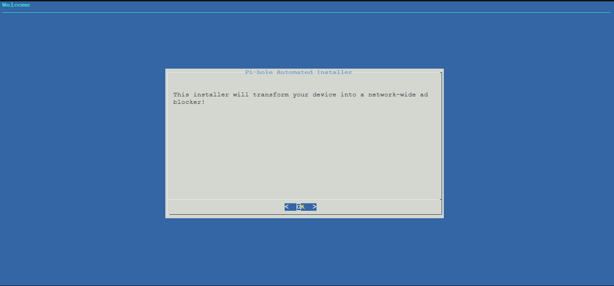
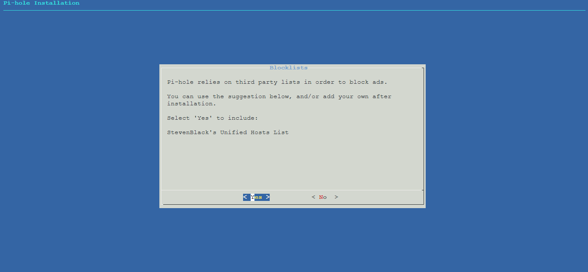

# Instalação do PiHole no Ubuntu

Este repositório fornece um guia para instalar o PiHole em um servidor Ubuntu, utilizando comandos simples para a configuração automática.

## Pré-requisitos

- Ubuntu 20.04 ou superior
- Acesso root ou sudo
- Conexão com a internet

## Passo a Passo de Instalação

### 1. Atualizar o sistema
Antes de instalar qualquer pacote, é recomendado atualizar o sistema para garantir que você tenha as versões mais recentes dos pacotes.

```bash
export DEBIAN_FRONTEND=noninteractive && apt update && apt -y install apache2 && a2enmod rewrite
```

### 2. Instalar o Curl
O comando a seguir instalará o `curl`, que é necessário para baixar o script de instalação do PiHole.

```bash
apt install curl
```

### 3. Instalar o PiHole
O PiHole pode ser instalado diretamente a partir do script oficial. Execute o comando abaixo para iniciar a instalação:

```bash
curl -sSL https://install.pi-hole.net | bash
```

Durante a instalação, você será guiado por algumas etapas de configuração, como definir o IP do servidor e escolher as fontes de DNS.
Como é mostrado nas imagens abaixo.







### 4. Configuração do PiHole

Após a instalação, é necessário configurar a senha de administrador do PiHole. Use o comando abaixo para definir a senha:

```bash
pihole -a -p
```
Isso permitirá que você defina a senha de acesso à interface web do PiHole.

### 5. Acesso à Interface Web
Após a instalação e configuração, você pode acessar a interface web do PiHole através do seguinte endereço no seu navegador:

```
http://<IP_do_servidor>/admin
```

Substitua `<IP_do_servidor>` pelo IP real do servidor onde o PiHole foi instalado.

## Considerações Finais

O PiHole está agora instalado e funcionando como um bloqueador de anúncios e rastreadores em sua rede. Você pode gerenciar as configurações e monitorar o tráfego de rede através da interface web.

Se você tiver problemas ou precisar de ajuda, consulte a documentação oficial do PiHole [aqui](https://docs.pi-hole.net/).

---
**Autoria**: Ian Maralhas (NeoDesk Informática)
**Licença**: MIT
```

Esse README cobre o processo de instalação básico, além de dar informações sobre como acessar o PiHole após a instalação. Você pode adicionar mais detalhes conforme necessário, dependendo de personalizações ou configurações adicionais que você queira incluir.


https://github.com/neodesk-informatica/Script-PiHole.git
